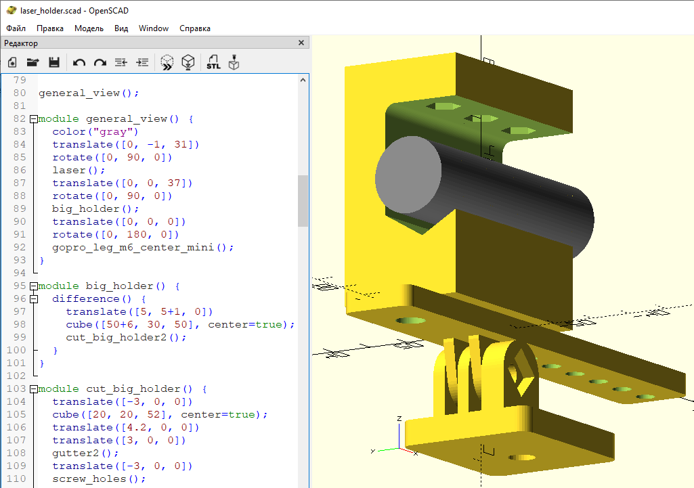
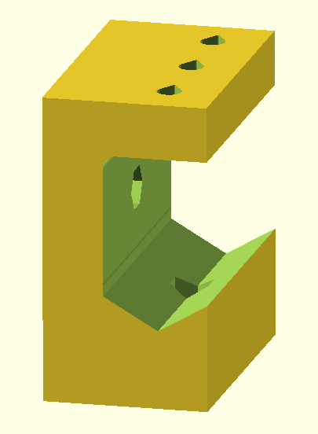
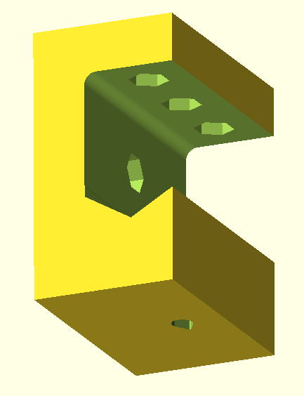
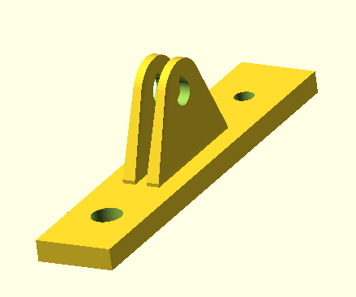
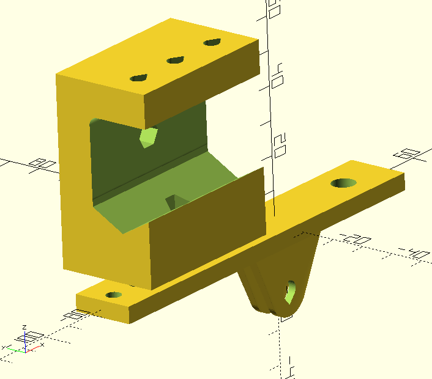

# Laser Pointer Holder
OpenScad 3D-model for 3D-printing

# Big Holder

# Big Holder - view 2

# GoPro stand for laser holder with hole of M6 screw

# GoPro stand and big laser holder

# Hyperlinks

1. [GoProScad](https://github.com/ridercz/GoProScad) GitHub repo of gopro tools, used M6_mount.

